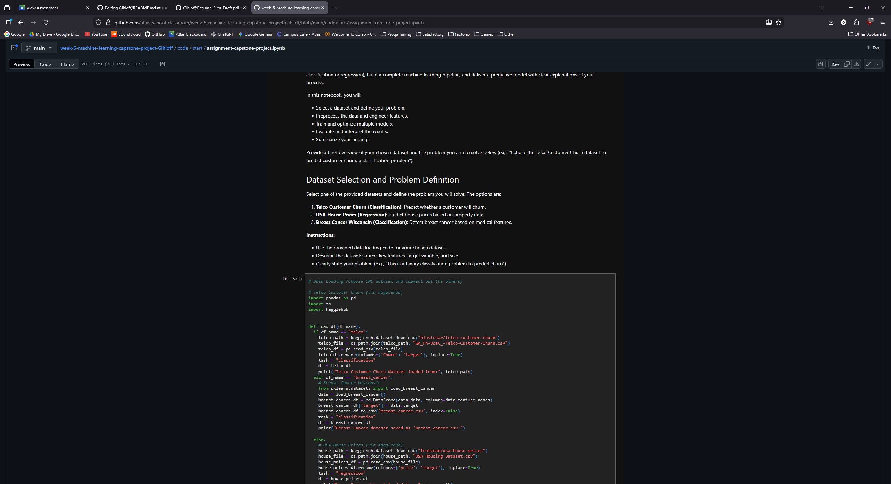
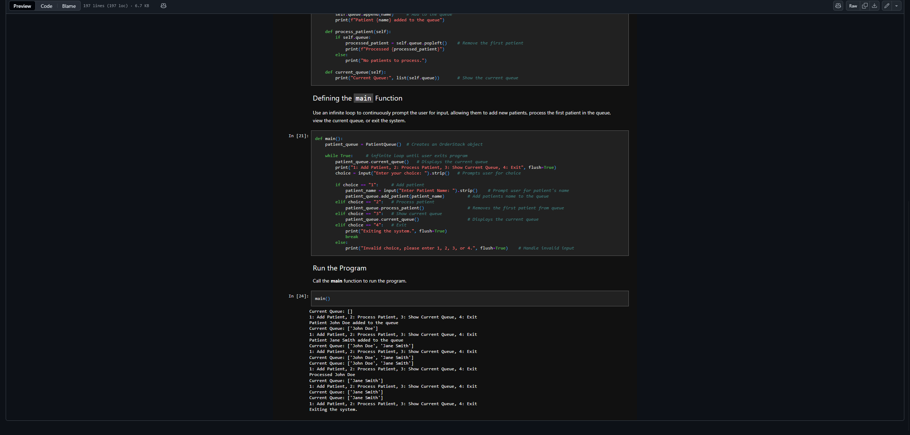
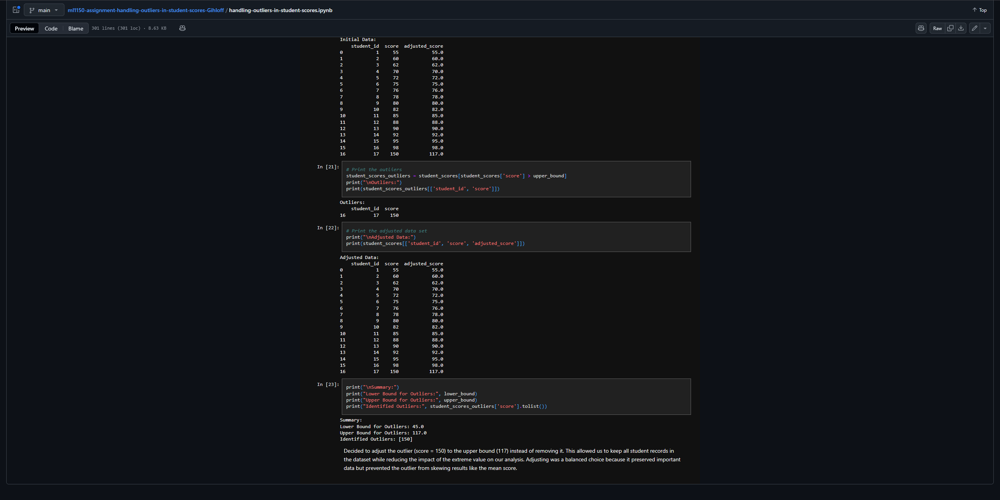

<!---
Gihloff/Gihloff is a ✨ special ✨ repository because its `README.md` (this file) appears on your GitHub profile.
You can click the Preview link to take a look at your changes.
--->
# Hi there, I'm Gabriel Ihloff 👋

### 👨‍💻 About Me

I am a **Machine Learning Student** at **Atlas School of Tulsa**, currently in my **4th Trimester (of 5)**. 

Since beginning my Machine Learning specialization in Trimester 3, I have focused on predictive modeling, data analysis, and Python-based data science tools. Unlike many data scientists, I started my journey with a rigorous **Full Stack Software Engineering** foundation. This unique combination allows me to not just build models, but understand the backend systems (C#, SQL) required to deploy and maintain them in production environments.

* **Primary Focus:** Machine Learning, Data Analytics, Python (Pandas, Scikit-Learn).
* **Technical Foundation:** C, C# (.NET), SQL, JavaScript, React, Node.
* **Education:** Atlas School of Tulsa (Vocational Software Engineering).

---

### 📊 Machine Learning & Data Projects

Here are three projects that highlight my focus on Data and Backend Engineering:

#### 1. Telco Customer Churn Analysis (Machine Learning)

*A predictive analytics project focused on customer retention. I performed extensive data cleaning and Exploratory Data Analysis (EDA) on the Telco dataset, then trained and evaluated models to predict customer churn with high accuracy.*
* **[View Notebook on GitHub](https://github.com/atlas-school-classroom/week-5-machine-learning-capstone-project-Gihloff.git)**
* **Tech Stack:** Python, Pandas, Scikit-Learn, Jupyter Notebook

#### 2. SQL Data Management System (Data Analytics)

*A comprehensive database project designed to handle complex queries and data relationships. This project demonstrates my ability to structure data efficiently, write optimized queries, and manage relational databases—a critical skill for preparing data for ML pipelines.*
* **[View Code on GitHub](https://github.com/atlas-school-classroom/cs1500-assignment-health-center-triage-system-Gihloff.git)**
* **Tech Stack:** SQL, Database Design

#### 3. Handling Outliers in Student Scores (Data Preprocessing)

*A focused data analysis project demonstrating techniques to detect and manage anomalies. I utilized statistical methods like Z-Scores and IQR (Interquartile Range) to identify outliers in student performance data, ensuring dataset integrity for future modeling.*
* **[View Code on GitHub](https://github.com/atlas-school-classroom/ml1150-assignment-handling-outliers-in-student-scores-Gihloff)**
* **Tech Stack:** Python, Pandas, NumPy, Matplotlib

---

### 📄 Resume
You can view my professional history and qualifications in detail here:

[**📥 Download My Resume (PDF)**](./Resume_First_Draft.pdf)

---

### 📫 Contact Me
I am open to opportunities in Data Science, Machine Learning, and Backend Engineering.

* 📧 **Email:** [gihloff@gmail.com](mailto:gihloff@gmail.com)
* 💼 **LinkedIn:** [https://www.linkedin.com/in/gabe-ihloff-4305a697/](https://www.linkedin.com/in/gabe-ihloff-4305a697/)
